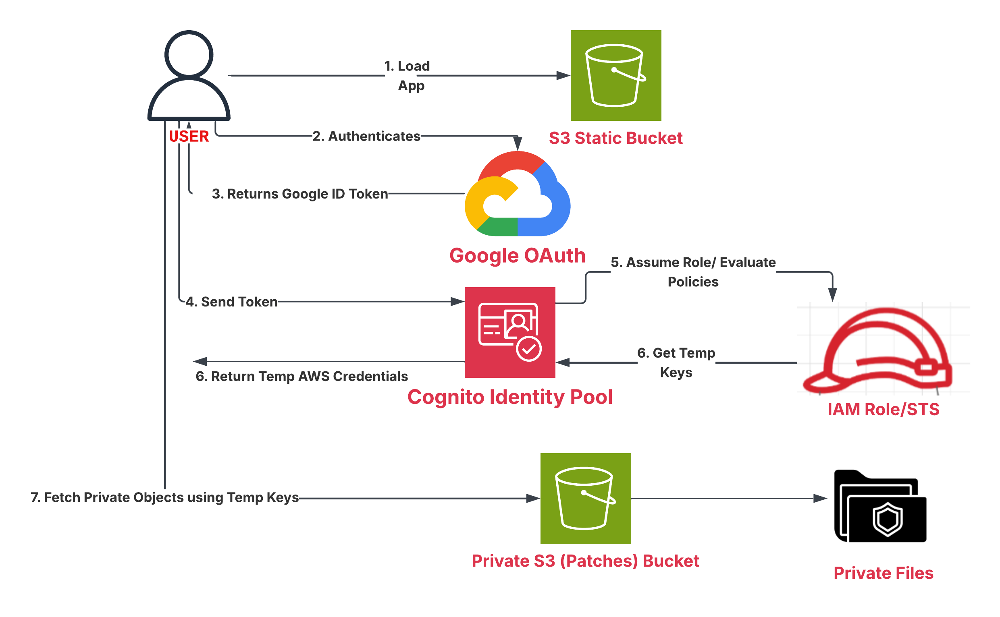

# AWS Serverless Web Application with Web Identity Federation


A production-grade, serverless web application architecture demonstrating secure **Web Identity Federation** using **Google OAuth 2.0**, **Amazon Cognito Identity Pools**, and **AWS IAM Policies**. This project showcases how to grant temporary, restricted AWS permissions to authenticated users to securely fetch private assets from Amazon S3 without exposing long-lived credentials or API keys.

---

## 🏗️ Architecture Overview

The system uses Google as an external Identity Provider (IdP) to authenticate users, exchanges the resulting OAuth ID token via Amazon Cognito Identity Pools for temporary AWS IAM credentials, and grants read-only access to specific S3 bucket prefixes.



### Authentication & Authorization Flow

1. **Load Application:** The user accesses the static web interface hosted on the **S3 Static Web Hosting Bucket**.
2. **Authenticate:** Clicking "Log In with Google" redirects the user to **Google OAuth 2.0** to authenticate.
3. **Return ID Token:** Upon successful login, Google returns a signed JWT **Google ID Token** back to the client browser.
4. **Exchange Token:** The client application forwards the Google ID Token to the **Amazon Cognito Identity Pool**.
5. **Evaluate & Assume Role:** Cognito verifies the token signature with Google, then requests temporary credentials by assuming an **IAM Role**.
6. **Issue Temporary Credentials:** Cognito receives temporary AWS Access Keys, Secret Key, and Session Token from STS and returns them to the browser.
7. **Secure Data Access:** The client uses these short-lived AWS credentials to directly download protected files from the **Private S3 Bucket**.

---

## 🛡️ Key Security & Architecture Concepts Demonstrated

* **Zero Hardcoded Secrets:** No long-lived AWS credentials exist within client-side JavaScript or server code. All access relies on short-lived AWS STS session keys.
* **Least Privilege Access:** IAM policies explicitly scope access to exact S3 bucket paths, enforcing fine-grained user access controls.
* **Separation of Identity & Storage:** Decouples identity verification (handled by Google/Cognito) from object storage access (handled by S3/IAM).

---

## 📁 Repository Structure

```text
.
├── README.md
├── Architecture/
│   └── architecture.png                     # System Architecture Diagram
├── Documents/
│   ├── 01-google-oauth-setup.png            # Configured OAuth 2.0 Client ID
│   ├── 02-cognito-identity-pool.png         # Cognito Identity Pool Configuration
│   ├── 03-iam-role-policy.png               # IAM Trust Relationship & Least Privilege Policy
│   └── 04-browser-console-success.png       # Successful S3 Object Retrieval Log
├── Templates/
│   └── S3-Cognito-Federation.yaml           # CloudFormation / Infrastructure as Code
└── Source Files/
    ├── index.html                           # Frontend User Interface
    └── scripts.js                           # AWS SDK Web Identity Exchange Logic

```

---

## 🚀 Deployment & Setup Guide

### Step 1: Google OAuth 2.0 Client Setup

1. Navigate to the **Google Cloud Console** > **APIs & Services** > **Credentials**.
2. Create an **OAuth 2.0 Client ID** configured as a Web Application.
3. Add your static S3 hosting domain to **Authorized JavaScript origins** and **Authorized redirect URIs**.
4. Save your generated Client ID.

### Step 2: Configure Amazon Cognito Identity Pool

1. In the AWS Console, navigate to **Amazon Cognito** > **Identity Pools**.
2. Create a new Identity Pool and select **Authenticated Access**.
3. Under **Authentication Providers**, select **Google** and input your Google Client ID.
4. Assign an **Authenticated IAM Role** containing the policy configured below.

### Step 3: Configure IAM Role & Policy

Attach an inline policy to your Authenticated IAM Role to restrict S3 access exclusively to the target private bucket:

```json
{
    "Version": "2012-10-17",
    "Statement": [
        {
            "Sid": "AllowPrivateBucketAccess",
            "Effect": "Allow",
            "Action": [
                "s3:GetObject",
                "s3:ListBucket"
            ],
            "Resource": [
                "arn:aws:s3:::your-private-patch-bucket",
                "arn:aws:s3:::your-private-patch-bucket/*"
            ]
        }
    ]
}

```

### Step 4: Deploy Frontend Assets

Update `Source Files/scripts.js` with your specific AWS region, Cognito Identity Pool ID, and Google Client ID, then upload the contents of `Source Files/` to your static hosting S3 bucket.

---

## 📌 Technical Engineering Notes

### 1. S3 Object Versioning & MFA Delete

* **Versioning States:** Buckets begin with versioning *Disabled*. Once enabled, versioning can only be *Suspended*—it can never be completely returned to un-versioned.
* **Storage Billing:** Billing applies to the cumulative size of all active and archived versions within a bucket.
* **Soft vs. Hard Deletes:** A basic `DELETE` request inserts a Delete Marker (Soft Delete). Hard deletion requires explicitly passing a specific `VersionId` parameter in the API call.
* **MFA Delete Safeguards:** Enforces Multi-Factor Authentication for modifying bucket versioning or permanently deleting object versions. Configurable only via AWS CLI/API using AWS Root User credentials.

### 2. Instance Metadata Service (IMDSv1 vs. IMDSv2)

* **Bootstrap Scripts (User-Data):** Executed during initial EC2 provisioning. Must never contain hardcoded secrets, as local OS accounts can read `/user-data/` via `169.254.169.254`.
* **IMDS Protection:**
* **IMDSv1:** Uses basic, stateless HTTP GET requests; vulnerable to local Server-Side Request Forgery (SSRF) vulnerabilities.
* **IMDSv2:** Uses session-oriented HTTP calls requiring a token (`PUT` request first) to protect against SSRF attacks.


---

## 🔒 Security & Privacy Notice

All AWS Account IDs, IAM Role ARNs, Google Client Secrets, and personal user identifiers in repository documentation screenshots (`/Documents`) have been sanitized in compliance with cloud security best practices.

---

## 📜 License

This project is licensed under the MIT License.

```

